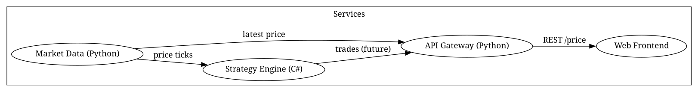

# Market Data Trading Platform

[](https://github.com/dj-3dub/market-data-trading-platform/actions/workflows/ci.yml)

A fully containerized microservices project showcasing DevOps engineering skills with Docker, Python, C#, Kafka, Prometheus, Grafana, and Terraform.

This platform simulates a small trading system with:

- A **market data service** that publishes streaming price data  
- A **strategy engine** written in C# that consumes data and exposes metrics  
- An **API gateway** (FastAPI) that fronts the services  
- A **web frontend** that visualizes the data  
- **Kafka** for streaming  
- **Prometheus + Grafana** for observability  
- **Terraform** for ECS Fargate infrastructure (designed for offline validation today)

---
## Operational Scenarios Covered

Planned and documented scenarios include:

- Kafka broker outage
- API gateway latency spike
- strategy engine health degradation
- stale data conditions
- service dependency failures
- observability blind spots

These scenarios are being documented first in WSL and will later be validated in the homelab with live command output, dashboards, and recovery evidence.

---

# Architecture



This project simulates a small trading platform built with a microservices and DevOps-first mindset. It’s designed to showcase:

- Containerized application services (Python, C#)
- Event streaming with Kafka
- Observability with Prometheus + Grafana
- Infrastructure as Code with Terraform (ECS Fargate)

## Components

### 1. Client Layer

- **Web Frontend (`web-frontend`)**
  - Containerized web UI
  - Talks to the API Gateway for all backend data
  - Exposes HTTP on port 80 inside the container (mapped to `8080` on the host)

### 2. API Layer

- **API Gateway (`api-gateway-python`)**
  - FastAPI service
  - Aggregates data from:
    - `market-data-python`
    - `strategy-csharp`
  - Provides a clean JSON API to the frontend
  - Exposes HTTP on port 8000

### 3. Services Layer

- **Market Data Service (`market-data-python`)**
  - Simulates streaming price updates
  - Publishes events to Kafka
  - Exposes Prometheus metrics (e.g. last price, update rate)

- **Strategy Engine (`strategy-csharp`)**
  - C#/.NET 9 service
  - Consumes market data (via HTTP and/or Kafka)
  - Runs a simple trading strategy
  - Exposes detailed metrics via `/metrics` (Prometheus format)

### 4. Messaging Layer

- **Zookeeper (`mdp-zookeeper`)**
  - Coordinates Kafka brokers

- **Kafka (`mdp-kafka`)**
  - Event bus for market data and strategy-related events
  - Used to demonstrate streaming integration in a trading-style system

### 5. Observability Layer

- **Prometheus (`mdp-prometheus`)**
  - Scrapes metrics from:
    - `market-data-python`
    - `strategy-csharp`
    - Any future exporters
  - Configured via `monitoring/prometheus/prometheus.yml`
  - Exposes the Prometheus UI/API on port 9090 (host-mapped to `9091`)

- **Grafana (`mdp-grafana`)**
  - Reads from Prometheus as a datasource
  - Dashboards provisioned from `monitoring/grafana/provisioning`
  - Used to visualize:
    - Market prices
    - Strategy metrics
    - Service health

### 6. Infrastructure as Code

- **Terraform (`infra/terraform/envs/aws-fargate`)**
  - Defines:
    - ECS cluster
    - Fargate task definitions
    - Services
    - Security group(s)
    - CloudWatch log group
  - Designed to be run in validation mode locally (no real apply in CI)
  - Can be pointed at a real AWS account by updating the provider and credentials

## Data Flow (High Level)

1. `market-data-python` generates simulated price data.
2. Data is:
   - Pushed into Kafka topics.
   - Exposed over HTTP for the API Gateway.
   - Exported as Prometheus metrics.
3. `strategy-csharp` consumes market data, runs a strategy, and publishes:
   - Strategy state / signals
   - Metrics for Prometheus.
4. `api-gateway-python` aggregates data from:
   - `market-data-python`
   - `strategy-csharp`
5. `web-frontend` calls the API Gateway to render a trading-style UI.
6. Prometheus scrapes all instrumented services.
7. Grafana visualizes those metrics on dashboards.

## Deployment Topology

### Local (Docker Compose)

- All services run as Docker containers on a single host.
- Networking is provided by the `trading-net` Docker network.
- Ports are published for:
  - Web UI (8080)
  - API Gateway (8000)
  - Prometheus (9091)
  - Grafana (3000)
  - Kafka/Kafka UI as configured

### Cloud (Terraform / ECS Fargate)

- Core services (market data, strategy, gateway, frontend) can be deployed as Fargate tasks.
- Logs are shipped to CloudWatch Logs.
- Networking is handled via security groups and VPC configuration.
- Load balancer / DNS can be layered on in future iterations.

---

This architecture doc, paired with the diagram, is meant to be a readable walkthrough for reviewers (hiring managers, engineers) who want to understand the system at a glance.


---

## 🚀 Running the Stack Locally

Requirements:

- Docker & Docker Compose
- Git

Clone and start:

```bash
git clone https://github.com/dj-3dub/market-data-trading-platform.git
cd market-data-trading-platform
docker compose up -d
```

Services:

- Web UI: `http://<host>:8080`
- API Gateway: `http://<host>:8000`
- Prometheus: `http://<host>:9091`
- Grafana: `http://<host>:3000` (default: admin/admin)

---

## 🧰 Ops Toolbox

This project includes a suite of diagnostic tools used to operate, troubleshoot, and validate the platform.

---

### 🔧 VM Doctor

Full system health check:

- CPU load  
- RAM availability  
- Swap usage  
- Disk usage  
- Docker container resource usage  
- Top processes  
- OK / WARN / CRIT indicators  

Run:

```bash
make doctor-vm
```

Located in `tools/vm-doctor/vm_doctor.sh`.

---

### 📈 Prometheus Doctor

Checks Prometheus health and target ingestion:

- API availability  
- Active targets  
- `up` status  
- Missing metrics  
- Missing scrape jobs  

Run:

```bash
python3 tools/prometheus-doctor/prometheus_doctor.py
```

Located in `tools/prometheus-doctor/prometheus_doctor.py`.

---

### 🟦 .NET Doctor (planned)

Will diagnose .NET SDK environments, workloads, runtimes, and container builds.

---

### 🐳 Future Tools

- Docker health/liveness probe tester  
- Port readiness validator  
- API smoke-test suite  

---

## 🚦 CI/CD Pipeline

A GitHub Actions workflow validates the entire platform on every push and PR.

### Pipeline includes:

### **Docker Build Validation**
Builds:

- `market-data-python`
- `api-gateway-python`
- `web-frontend`

### **.NET Strategy Engine Build**
Restores & compiles `.NET 9` C# code.

### **Terraform Validation**
Runs:

- `terraform fmt -check`
- `terraform validate`  
  (offline mode; no real AWS credentials required)

Workflow file:

```
.github/workflows/ci.yml
```

---

## 🧱 Project Layout

```
services/
  market-data-python/
  api-gateway-python/
  strategy-csharp/
  web-frontend/

monitoring/
  prometheus/
  grafana/

infra/
  terraform/
    envs/
      aws-fargate/

tools/
  vm-doctor/
  prometheus-doctor/

docs/
  architecture.md
  architecture.dot

docker-compose.yml
Makefile
README.md
```

## Reliability Engineering and Operations Focus

This project is designed not only as a market-data trading platform simulation, but also as an operations and reliability engineering lab. In addition to service architecture and deployment, the repository includes:

- incident writeups
- recovery runbooks
- troubleshooting guidance
- failure-injection planning
- observability strategy documentation

The goal is to demonstrate how distributed trading-style systems behave under failure, how issues are triaged, and how monitoring and automation can improve resilience over time.

---

## 🔮 Future Improvements

- Unit/integration tests (Python + C#)  
- Terraform expansion (ALB, Route 53, Secrets Manager)  
- Grafana alerting  
- Additional exporters  
- CI test matrix  

---

## 📄 License

MIT or Apache 2.0 (optional — choose if you add one)

