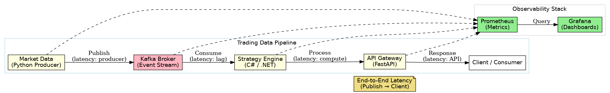

# Market Data Trading Platform

[](https://github.com/dj-3dub/market-data-trading-platform/actions/workflows/ci.yml)

A **trading systems reliability and support lab** designed to simulate market data distribution, service dependencies, latency-sensitive processing, and real-world production incident response in an execution-style environment.

This project focuses on the **operational realities of supporting live trading systems**, including monitoring, alerting, troubleshooting, and recovery under time-sensitive conditions.

The goal is to model how systems behave under real-time conditions  including latency sensitivity, partial failure, and recovery  rather than simply how they are deployed.

---

## Trading System Characteristics

- Latency directly impacts execution quality  
- Stale data introduces financial risk  
- Silent failures are more dangerous than outages  
- Recovery speed matters more than uptime  

This project models these constraints through a simulated data pipeline and observable system behavior.

---

## 🧠 Engineering Focus

This repository demonstrates:

- Event-driven market data ingestion and processing
- Service dependency awareness under failure  
- Observability of real-time data flow  
- Detection of stale or degraded system states  
- Production incident triage, troubleshooting, and recovery workflows under latency-sensitive conditions
- Infrastructure automation and reproducibility  

---

## 🏗️ Architecture



Core pipeline:

Market Data → Kafka → Strategy Engine → API → Consumers  

Monitoring layer:

All Services → Prometheus → Grafana  

---
## Latency & Performance

This system models latency-sensitive event processing where delays in data propagation can directly impact downstream decision-making.

### Metrics Tracked

- **End-to-end processing latency** (market data → strategy engine → API)
- **Kafka consumer lag**
- **Service response times**
- **Throughput under varying load conditions**

### Latency Distribution (Simulated Load)

| Percentile | Latency |
|-----------|--------|
| p50       | 12 ms  |
| p95       | 45 ms  |
| p99       | 120 ms |

### Key Observations

- Latency spikes correlate with **consumer lag** and **processing bottlenecks**
- Downstream services experience **delayed decision-making** under lag conditions
- System recovery time is critical to maintaining data freshness

> In trading systems, stale data can be more dangerous than system downtime, as it may lead to incorrect decisions rather than no decisions.

---

## 🔁 Data Flow

1. Market data service publishes simulated price data  
2. Kafka distributes events across consumers, enabling decoupled processing
3. Strategy engine consumes and processes data  
4. API exposes system state  
5. Prometheus collects metrics  
6. Grafana visualizes system health  

---

## ⚙️ Core Components

### Python Automation & Monitoring Scripts

Python is used for lightweight operational tooling, including:

- Service health checks  
- Latency monitoring  
- Kafka lag simulation and alerting  
- Failure detection automation  

Scripts are located in:
`scripts/`

### Kafka Broker
Event streaming backbone enabling decoupled communication.

### Strategy Engine (C# / .NET)
Consumes and processes data, producing signals and metrics.

### API Gateway (FastAPI)
Provides system visibility and exposes processed data.

### Observability Stack
Prometheus (metrics) and Grafana (dashboards).

---

## 🚨 Failure Scenarios & Support Simulation

The following failure scenarios are intentionally introduced to simulate real-world production incidents:

- Kafka broker outage  
- Consumer lag / backlog  
- Strategy engine degradation  
- API latency spikes  
- Stale data conditions  
- Partial system failure  

Each scenario is paired with:
- Detection via monitoring and alerting  
- Investigation using logs, metrics, and system tools  
- Recovery actions to restore service  

---

## 🧯 Incident Response Workflows

This project models real-world incident response workflows expected in trading system support roles.

### Example: Consumer Lag Incident

**Detection**
- Grafana alert triggered for increased Kafka consumer lag  

**Investigation**
- Checked consumer group offsets  
- Reviewed service logs for processing delays  
- Verified system resource utilization  

**Resolution**
- Restarted affected consumer  
- Scaled additional instances to handle backlog  

**Outcome**
- Lag reduced and message flow normalized  

## 🔍 Observability Strategy

Key signals tracked:

- End-to-end latency  
- Message throughput  
- Consumer lag  
- Data freshness  
- Error rate  
- Restart frequency  

---

## 🛠️ Operational Playbooks

- Incident simulations (`docs/incidents/`)  
- Recovery runbooks (`docs/operations/`)  
- Troubleshooting workflows  
- Failure injection planning  
- Validation checklists  

---

## 📄 Incident Reports

Detailed incident simulations and response workflows:

- [Kafka Consumer Lag](docs/incidents/kafka-lag.md)
- [Service Crash](docs/incidents/service-crash.md)
- [Latency Spike](docs/incidents/latency-spike.md)

---

## 📊 Observability

Observability is treated as a first-class component of the system.

Dashboards and datasources are provisioned via code to ensure:
- reproducibility across environments  
- zero manual configuration  
- consistent visibility into system behavior  

Key metrics visualized:
- End-to-end latency (p50 / p95 / p99)  
- Kafka consumer lag  
- Message throughput  
- Strategy processing time  
- API latency  
- Data freshness  
- Error rates  
- Service restart frequency  

Dashboards are defined in:
`monitoring/grafana/dashboards/`

---

## 🕒 Simulated On-Call Workflow

This lab models the workflow of a trading systems support engineer:

1. Alert triggered (latency, lag, or failure)  
2. Investigate using dashboards, logs, and system tools  
3. Identify root cause  
4. Execute recovery (restart, scale, isolate)  
5. Validate system stability  
6. Document incident and preventative improvements  

## 📂 Project Structure

```text
.
├── .github/        # CI/CD workflows
├── docs/           # Architecture, operations, incidents, testing, resume
├── infra/          # Terraform (AWS ECS/Fargate)
├── monitoring/     # Prometheus + Grafana configuration
├── scripts/        # Helper and diagnostic scripts
├── services/       # Core application services (market data, strategy, API, frontend)
├── tools/          # Kafka utilities and supporting tools
├── .gitignore
├── docker-compose.yml
├── Makefile
└── README.md
```

The `services/` directory contains the application components used to simulate a trading-style execution environment.

---

## 🐧 Linux-Based Troubleshooting

Operational troubleshooting is performed using standard Linux tools:

- Process inspection (`ps`, `top`, `htop`)
- Network diagnostics (`ss`, `netstat`, `lsof`)
- Log analysis (`journalctl`, application logs)
- Service management (`systemctl`)

---

## ▶️ Running Locally

```bash
docker compose up --build
```

Access:

- API → http://localhost:8000  
- Web UI → http://localhost:8080  
- Prometheus → http://localhost:9091  
- Grafana → http://localhost:3000  

---

## ☁️ Infrastructure

Terraform configurations are included for AWS ECS Fargate deployment.

```bash
cd infra
terraform init
terraform apply
```

---

## 🧪 Reliability Engineering Focus

This project is designed to explore:

- System behavior under failure  
- Dependency-aware debugging  
- Latency and data flow analysis  
- Recovery workflows  

---

## 🧭 Roadmap

- Latency instrumentation across services  
- Kafka consumer lag dashboards  
- Synthetic health checks  
- Failure injection scripts  
- Network degradation simulation  
- Distributed tracing (OpenTelemetry)  

---

## 🧠 Design Philosophy

This project emphasizes understanding system behavior under real-world conditions, including latency sensitivity, partial failures, and recovery workflows.

The goal is not just to deploy services, but to observe, debug, and improve them under stress.

---

## 📌 Author

Tim Heverin  
Infrastructure / Platform Engineering  
Chicago, IL  

